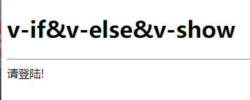

[toc]

# Vue的基本指令

[Vue官方网站]( https://vuejs.org/ )

[Vue官方网站(中文)]( https://cn.vuejs.org/ )

什么是指令？

​		 指令 (Directives) 是带有 `v-` 前缀的特殊特性。指令特性的值预期是**单个 JavaScript 表达式** (`v-for` 是例外情况，稍后我们再讨论)。指令的职责是，当表达式的值改变时，将其产生的连带影响，响应式地作用于 DOM。 

## 编写第一个HelloWorld

```html
<!DOCTYPE html>
<html lang="en">
<head>
    <meta charset="UTF-8">
    <script type="text/javascript" src="../assets/js/vue.js"></script>
    <title>Helloworld</title>
</head>
<body>
<h1>Hello World</h1>
<hr>
<div id="app">
    {{message}}
</div>

<script type="text/javascript">
    var app=new Vue({
        el:'#app',
        data:{
            message:'hello Vue!'
        }
    })
</script>
</body>
</html>
```

运行后显示结果为


```html
<div id="app">
    {{message}}
</div>
```

{{message}}用的是插值表达式获取到实例中的数据

```javascript
<script type="text/javascript">
    var app=new Vue({
        el:'#app',
        data:{
            message:'hello Vue!'
        }
    })
</script>
```

这里创建了一个vue实例

el:里填写的则是一个页面上已存在的DOM元素作为Vue实例的挂载目标。可以是CSS选择器，也可以是一个HTMLElement实例。

el:'#app'则相当于让Vue接管这片区域

data:{...}中则是定义数据

___写代码时别忘记导入vue.js___

[Vue官方文档: 声明式渲染](https://cn.vuejs.org/v2/guide/#%E5%A3%B0%E6%98%8E%E5%BC%8F%E6%B8%B2%E6%9F%93)

## v-if & v-show

**`v-if`的使用：**

**v-if:是vue 的一个内部指令，指令用在我们的html中。**

**v-if 用来判断是否加载html的DOM，比如我们模拟一个用户登录状态，在用户登录后现实用户名称。**

*`v-show` 功能与v-if类似，都是判断是否显示某个值，可v-show是通过样式修改*

~~~html
<body>
<h1>v-if&v-else&v-show</h1>
<hr>
<div id="app">
    <div v-if="isLogin">你好,欢迎 这是v-if</div>
    <div v-else>请登陆!</div>

    <div v-show="isLogin">你好,欢迎 这是v-show</div>
</div>

<script type="text/javascript">
    var app=new Vue({
        el:'#app',
        data:{
            isLogin: true
        }
    })
</script>
</body>
~~~

除了`v-if`还有`v-else`，若`v-if`和`v-else`同时出现，当`v-if`不满足条件时则会显示`v-else`。

当isLogin为true时，显示结果为


当isLogin为false时，显示结果为



***v-if如果为false   则不加载       可以减轻服务器的压力，在需要时加载***

***v-show为false则是修改css样式display="none"  仍然加载    可以使客户端操作更加流畅***


[Vue官方文档: 条件渲染]( https://cn.vuejs.org/v2/guide/conditional.html )

## v-for

 `v-for` 指令基于一个数组来渲染一个列表。`v-for` 指令需要使用 `item in items` 形式的特殊语法，其中 `items` 是源数据数组，而 `item` 则是被迭代的数组元素的**别名**。 

~~~html
<body>
    <h1>v-for</h1>
    <hr>
    <div id="app">
        <ul>
            <li v-for="item in array" >
                {{item}}
            </li>
        </ul>
    </div>
    <script type="text/javascript">
        var app=new Vue({
            el:'#app',
            data :{
                array:[1,2,3,'aaa','bbb'],
            }
        })
    </script>
</body>
~~~

运行结果:


`v-for`还支持一个可选的第二个参数，即当前项的索引。例：

~~~html
<ul>
    <li v-for="(item,index) in array" >
        array[{{index}}] = {{item}}   
    </li>
</ul>
~~~

运行结果:


`v-for`遍历对象的属性

~~~html
<body>
<h1>v-for</h1>
<hr>
<div id="app">
    <ul>
        <li v-for="value in map" >
            value
        </li>
    </ul>
<script type="text/javascript">
    var app=new Vue({
        el:'#app',
        data :{
            map: {
                no:20,
                name:'小明',
                gender:'男'
            }
        }
    })
</script>
</body>
~~~

运行结果:


正如上面所说v-for还支持第二个参数(property名称 即键名)

~~~html
<ul>
    <li v-for="(value,key) of map" >
        {{key}} : {{value}}
    </li>
</ul>
~~~

运行结果:


~~~html
<body>
<h1>v-for</h1>
<hr>
<div id="app">
    <ul>
        <li v-for="student in students" >
            {{student.name}}
        </li>
    </ul>
</div>
<script type="text/javascript">
    var app=new Vue({
        el:'#app',
        data :{
            students:[{
                name:'小明',
                age:12,
                sex:'男'
            },{
                name:'小红',
                age:13,
                sex:'女'
            },{
                name:'小蓝',
                age:14,
                sex:'男'
            }],
        }
    })
</script>
</body>
~~~

运行结果：


**Vue官方文档写明： 你也可以用 `of` 替代 `in` 作为分隔符，因为它更接近 JavaScript 迭代器的语法：** 

`item in items`也可以写成`item of items`

[Vue官方文档: 列表渲染]( https://cn.vuejs.org/v2/guide/list.html )

## v-text&v-html

### v-text

v-text :  更新元素的 `textContent`。如果要更新部分的 `textContent` ，需要使用 `{{ Mustache }}`(插值表达式) 插值。 

```html
<span>{{ message }}</span>
<!--上面和下面效果是一样的-->
<span v-text="message"></span>
```

但两者之间又有着部分差异

若vue对象创建出错，或者由于网络过慢，下面的script还没加载出来

{{ message }}是会直接显示成 {{ message }}  而不是 hello Vue而

**<span v-text="message"></span>** 则不会显示出来，而是等vue对象加载出来才显示

[Vue官方文档 : v-text](https://cn.vuejs.org/v2/api/#v-text)

### v-html

v-html :  更新元素的 `innerHTML` 。**注意：内容按普通 HTML 插入 - 不会作为 Vue 模板进行编译** 。如果试图使用 `v-html` 组合模板，可以重新考虑是否通过使用组件来替代。 

~~~html
<body>
    <h1>v-text & v-html 案例</h1>
    <hr>
    <div id="app">
        <span v-html="vHtml"></span>
    </div>

    <script type="text/javascript">
        var app = new Vue({
            el: '#app',
            data: {
                vHtml: '<h2>hello Vue!</h2>'
            }
        })
    </script>
</body>
~~~


[Vue官方文档 : v-html]( https://cn.vuejs.org/v2/api/#v-html )

[HTML]( [https://cn.vuejs.org/v2/guide/syntax.html#%E5%8E%9F%E5%A7%8B-HTML](https://cn.vuejs.org/v2/guide/syntax.html#原始-HTML) )

## v-on

 v-on : 绑定事件监听器。  事件类型由参数指定。表达式可以是一个方法的名字或一个内联语句，如果没有修饰符也可以省略。 

 用在普通元素上时，只能监听[**原生 DOM 事件**](https://developer.mozilla.org/zh-CN/docs/Web/Events)。用在自定义元素组件上时，也可以监听子组件触发的**自定义事件**。 

```html
<body>
    <h1>v-on</h1>
    <hr>
    <div id="app">
        <button v-on:click="test">测试</button>
    </div>

    <script type="text/javascript">
        var app = new Vue({
            el: '#app',
            data: {
                vHtml: '<h2>hello Vue!</h2>'
            },
            methods:{
                test:function () {
                    alert("v-on能监听到click事件");
                }
            }
        })
    </script>
</body>
```


v-on能缩写成@

```html
<button v-on:click="test">测试</button>
<!--与下面相同-->
<button @click="test">测试</button>
```

- 修饰符

  -  `.stop` - 调用 `event.stopPropagation()`。 
  -  `.prevent` - 调用 `event.preventDefault()`。 
  - `.capture` - 添加事件侦听器时使用 capture 模式。
  - `.self` - 只当事件是从侦听器绑定的元素本身触发时才触发回调。
  - `.{keyCode | keyAlias}` - 只当事件是从特定键触发时才触发回调。
  - `.native` - 监听组件根元素的原生事件。
  - `.once` - 只触发一次回调。
  - `.left` - (2.2.0) 只当点击鼠标左键时触发。
  - `.right` - (2.2.0) 只当点击鼠标右键时触发。
  - `.middle` - (2.2.0) 只当点击鼠标中键时触发。
  - `.passive` - (2.3.0) 以 `{ passive: true }` 模式添加侦听器

  更多样例可前去Vue官网观看

  [Vue官方文档 : v-on]( https://cn.vuejs.org/v2/api/#v-on )

## v-model

v-model :  在表单控件`<input>` 、`<textarea>`及`<select>`或者组件上创建双向绑定。细节请看下面的教程链接。 

```html
<body>
    <h1>v-model</h1>
    <hr>
    <div id="app">
        <p>message = {{message}}</p>
        <h3>文本框</h3>
        <p>v-model:<input type="text" v-model="message"></p>
    </div>
    <script type="text/javascript">
        var app = new Vue({
            el: '#app',
            data: {
                message:'hello Vue!'
            }
        })
    </script>
</body>
```


- 修饰符
  - [`.lazy`](https://cn.vuejs.org/v2/guide/forms.html#lazy) - 取代 `input` 监听 `change` 事件
  - [`.number`](https://cn.vuejs.org/v2/guide/forms.html#number) - 输入字符串转为有效的数字
  - [`.trim`](https://cn.vuejs.org/v2/guide/forms.html#trim) - 输入首尾空格过滤

```html
<body>
    <h1>v-model 双向数据绑定</h1>
    <hr>
    <div id="app">
        <p>message = {{message}}</p>
        <h3>文本框</h3>
        <p>v-model:<input type="text" v-model="message"></p>
        <p>v-model.lazy:<input type="text" v-model.lazy="message"></p><!--延迟加载-->
        <p>v-model.number:<input type="text" v-model.number="message"></p><!--只显示数字   若最开始就输入其他文本 则就没用了 仍会显示其他文本-->
        <p>v-model.trim=<input type="text" v-model.trim="message"></p><!--去除前后空格-->
        <hr>

        <h3>文本域</h3>
        <textarea cols="20" rows="20" v-model="message"></textarea>
        <hr>

        <h3>多选框绑定一个值</h3>
        <input type="checkbox" id="isSelected" v-model="isSelected">
        <label for="isSelected">{{isSelected}}</label>
        <hr>

        <h3>多选框绑定数组</h3>
        <input type="checkbox" id="red" value="小红" v-model="student_names">
        <label for="isSelected">小红</label>
        <input type="checkbox" id="yellow" value="小黄" v-model="student_names">
        <label for="isSelected">小黄</label>
        <input type="checkbox" id="blue" value="小蓝" v-model="student_names">
        <label for="isSelected">小蓝</label>
        <p>
            {{student_names}}
        </p>
        <hr>

        <h3>单选框绑定</h3>
        <p>
            <input type="radio" id="one" value="男" v-model="gender">
            <label for="one">男</label>
            <input type="radio" id="two" value="女" v-model="gender">
            <label for="two">女</label>
            <p>选择的性别为:{{gender}}</p>
        </p>
    </div>

    <script type="text/javascript">
        var app=new Vue({
            el:'#app',
            data:{
                message:'hello Vue!',
                isSelected:true,
                student_names:[],
                gender:''
            }
        })
    </script>
</body>
```

[Vue官方文档 v-model]( https://cn.vuejs.org/v2/api/#v-model )

[Vue官方文档 表单输入绑定]( https://cn.vuejs.org/v2/guide/forms.html )

[Vue官方文档 将原生事件绑定到组件]( https://cn.vuejs.org/v2/guide/forms.html )(可以等看完组件后再看)

## v-bind

v-bind : 可用于绑定标签的属性

- 修饰符
  - `.prop` - 被用于绑定 DOM 属性 (property)。([差别在哪里？](https://stackoverflow.com/questions/6003819/properties-and-attributes-in-html#answer-6004028))
  - `.camel` - (2.1.0+) 将 kebab-case 特性名转换为 camelCase. (从 2.1.0 开始支持)
  - `.sync` (2.3.0+) 语法糖，会扩展成一个更新父组件绑定值的 `v-on` 侦听器。

v-bind 的缩写为:

例如绑定img的src      a标签的href

```html
<body>
<h1>v-bind 实例</h1>
<hr>
<div id="app">
    
    <!--v-bind 缩写 :-->
    <hr>
    <a :href="url" target="_blank">跳转</a>
</div>

<script type="text/javascript">
    var app=new Vue({
        el:'#app',
        data:{
            imgUrl:"https://www.baidu.com/img/bd_logo1.png?where=super",
            url:"https://www.baidu.com" 
        }
    })
</script>
</body>
```


还有可以class和style

~~~html
<body>
<h1>v-bind 实例</h1>
<hr>
<div id="app">
    <div :class="className">1.绑定class</div>
    <hr>
    <div :class="{classA:isOk}">2.绑定class中的判断</div>
    <hr>
    <div :class="[classA,classB]">3、绑定class中的数组</div>
    <hr>
    <div :class="isOk?classA:classB">4、绑定class中的三元表达式判断</div>
    <hr>
    <div>
        <input type="checkbox" id="isOk" v-model="isOk">
        <label for="isOk" >isOk = {{isOk}}</label>
    </div>
    <hr>
    <div :style="{color:red,fontSize:font}">5、绑定style</div>
    <hr>
    <div :style="styleObject">6、用对象绑定style样式</div>
</div>

<style>
    .classA{
        color: red;
    }
    .classB{
        font-size: 150%;
    }
</style>

<script type="text/javascript">
    var app=new Vue({
        el:'#app',
        data:{
            className:"classA",
            isOk:false,
            classA:"classA",
            classB:"classB",
            red:"red",
            font:"20px",
            styleObject:{
                fontSize:'24px',<!--font-size在vue中要变成fontSize的写法-->
                color:'green'
            }
        }
    })
</script>
</body>
~~~


[Vue官方文档 : v-bind]( https://cn.vuejs.org/v2/api/#v-bind  )

[Vue官方文档 : Class 与 Style 绑定](https://cn.vuejs.org/v2/guide/class-and-style.html)

## v-pre

v-pre 

- **不需要表达式**

- **用法**：跳过这个元素和它的子元素的编译过程。可以用来显示原始 Mustache 标签。跳过大量没有指令的节点会加快编译。

```html
<span v-pre>{{ this will not be compiled }}</span>
```

显示结果将会是      {{ this will not be compiled }} 

[Vue官方文档 : v-pre](  https://cn.vuejs.org/v2/api/#v-pre )

## v-cloak

- **不需要表达式**
- **用法**：这个指令保持在元素上直到关联实例结束编译。和 CSS 规则如 `[v-cloak] { display: none }` 一起用时，这个指令可以隐藏未编译的 Mustache 标签直到实例准备完毕。

~~~html
<div v-cloak>渲染完成后 才显示</div>
~~~

只有让Vue渲染完成后才会显示该元素

[Vue官方文档 : v-cloak]( https://cn.vuejs.org/v2/api/#v-cloak)

## v-once

- **不需要表达式**
- **详细**：只渲染元素和组件**一次**。随后的重新渲染，元素/组件及其所有的子节点将被视为静态内容并跳过。这可以用于优化更新性能。

```html
<body>
<h1>v-pre & v-cloak & v-once 实例</h1>
<hr>
    <div id="app">
        <div v-once>{{message}}</div><!--只进行一次渲染-->
        <div><input type="text" v-model="message"></div>
        <div >{{message}}</div>
    </div>

    <script type="text/javascript">
        var app=new Vue({
            el:'#app',
            data:{
                message:'hello Vue!'
            }
        })
    </script>
</body>
```


# Vue的全局API

全局API是什么？

​	 全局API并不在构造器里，而是先声明全局变量或者直接在Vue上定义一些新功能，Vue内置了一些全局API，比如我们今天要学习的指令Vue.directive。说的简单些就是，在构造器外部用Vue提供给我们的API函数来定义新的功能。 

## Vue.directive 自定义指令

定义一个全局的指令。使用Vue.directive();

~~~javascript
Vue.directive('cr',function (el,binding,vnode) {
    	el.style='color:'+binding.value;
});
~~~

```html
<body>
<h1>vue.directive 自定义指令 实例</h1>
<hr>
<div id="app">
    <div v-cr="color">{{n}}</div><!--自定义指令-->
</div>

<script type="text/javascript">
    Vue.directive('cr',function (el,binding,vnode) {
            el.style='color:'+binding.value;
        }
    );
    var app=new Vue({
        el:'#app',
        data:{
            n:15,
            color:'red'
        }
    })
</script>
</body>
```

效果如图


自定义指令中传递的三个参数

- el: 指令所绑定的元素，可以用来直接操作DOM。
- binding: 一个对象，包含指令的很多信息。
- vnode: Vue编译生成的虚拟节点。

自定义指令有五个生命周期（也叫钩子函数），分别是 bind,inserted,update,componentUpdated,unbind

```html
<body>
<h1>vue.directive 自定义指令 实例</h1>
<hr>
<div id="app">
    <div v-aa="color">{{n}}</div><!--自定义指令-->
    <div><button @click="add">add</button></div>
    <div><button onclick="unbind()">解绑</button></div>
</div>

<script type="text/javascript">
    Vue.directive('aa',{
            bind:function(){//被绑定
                console.log('1 - bind');
            },
            inserted:function(){//绑定到节点
                console.log('2 - inserted');
            },
            update:function(){//组件更新
                console.log('3 - update');
            },
            componentUpdated:function(){//组件更新完成
                console.log('4 - componentUpdated');
            },
            unbind:function(){//解绑
                console.log('5 - unbind');
            }
        }
    );
    function unbind() {
        app.$destroy();
    }
    var app=new Vue({
        el:'#app',
        data:{
            n:15,
            color:'red'
        },
        methods:{
            add:function () {
                this.n++;
            }
        }
    })
</script>
</body>
```

刚打开页面时


控制台显示


点击几次add按钮后


点击解绑后

且再点击add按钮已经没有任何变化

### 钩子函数

 	一个指令定义对象可以提供如下几个钩子函数 (均为可选)： 

- `bind`：只调用一次，指令第一次绑定到元素时调用。在这里可以进行一次性的初始化设置。
- `inserted`：被绑定元素插入父节点时调用 (仅保证父节点存在，但不一定已被插入文档中)。
- `update`：所在组件的 VNode 更新时调用，**但是可能发生在其子 VNode 更新之前**。指令的值可能发生了改变，也可能没有。但是你可以通过比较更新前后的值来忽略不必要的模板更新 (详细的钩子函数参数见下)。

我们会在[稍后](https://cn.vuejs.org/v2/guide/render-function.html#虚拟-DOM)讨论[渲染函数](https://cn.vuejs.org/v2/guide/render-function.html)时介绍更多 VNodes 的细节。

- `componentUpdated`：指令所在组件的 VNode **及其子 VNode** 全部更新后调用。
- `unbind`：只调用一次，指令与元素解绑时调用。

### 钩子函数参数

 指令钩子函数会被传入以下参数： 

- `el`：指令所绑定的元素，可以用来直接操作 DOM 。
- `binding`：一个对象，包含以下属性：
  - `name`：指令名，不包括 `v-` 前缀。
  - `value`：指令的绑定值，例如：`v-my-directive="1 + 1"` 中，绑定值为 `2`。
  - `oldValue`：指令绑定的前一个值，仅在 `update` 和 `componentUpdated` 钩子中可用。无论值是否改变都可用。
  - `expression`：字符串形式的指令表达式。例如 `v-my-directive="1 + 1"` 中，表达式为 `"1 + 1"`。
  - `arg`：传给指令的参数，可选。例如 `v-my-directive:foo` 中，参数为 `"foo"`。
  - `modifiers`：一个包含修饰符的对象。例如：`v-my-directive.foo.bar` 中，修饰符对象为 `{ foo: true, bar: true }`。
- `vnode`：Vue 编译生成的虚拟节点。移步 [VNode API](https://cn.vuejs.org/v2/api/#VNode-接口) 来了解更多详情。
- `oldVnode`：上一个虚拟节点，仅在 `update` 和 `componentUpdated` 钩子中可用。

**除了 `el` 之外，其它参数都应该是只读的，切勿进行修改。如果需要在钩子之间共享数据，建议通过元素的 [`dataset`](https://developer.mozilla.org/zh-CN/docs/Web/API/HTMLElement/dataset) 来进行。**

[Vue官方文档 : Vue.directive]( https://cn.vuejs.org/v2/api/#Vue-directive )

[自定义指令]( https://cn.vuejs.org/v2/guide/custom-directive.html )

## Vue.extend

- **参数**：
  
- `{Object} options`
  
- **用法**：

  使用基础 Vue 构造器，创建一个“子类”。参数是一个包含组件选项的对象。

  **`data` 选项是特例，需要注意 - 在 `Vue.extend()` 中它必须是函数**

```html
<body>
<h1>Vue.extend 扩展实例构造器</h1>
<hr>

<baidu></baidu>
<div id="baidu"></div>

<script type="text/javascript">
    var obj = Vue.extend({
        template:"<p><a :href='url'>{{message}}</a></p>",
        //这里的data不像在构造器里写data直接写   而是要写个匿名方法 return一个对象
        data:function () {
            return{
                message:'百度',
                url:'https://www.baidu.com'
            }
        }
    });

    //所有的扩展实例构造器都需要另一个操作 绑定(加载)到上面才可以用
    //Vue的$mount()为手动挂载
    //可以像jquery一样绑定
    new obj().$mount('baidu');//根据标签绑定
    new obj().$mount('#baidu');//根据id绑定
</script>
</body>
```


[Vue官方文档 : Vue.extend]( https://cn.vuejs.org/v2/api/#Vue-extend )

## Vue.set

### 引用构造器外部数据

```javascript
<script type="text/javascript">
    var outDate = {
        count : 1
    } ;
    var app=new Vue({
        el:'#app',
        data : outDate
    })
</script>
```

```html
<div id="app">
    {{count}}
</div>
```

在页面上count能够显示出来


### 在作用域外部改变数据的三种方法

~~~javascript
function add() {
	Vue.set(outData,'count',3);
}
~~~

~~~javascript
function add() {
	app.count++;
}
~~~

~~~javascript
function add() {
    outData.count++;
}
~~~

### 为什么需要Vue.set

由于JavaScript的限制，Vue中不能检测到数组和对象的两种变化：

- 数组长度的变化 vm.arr.length = 4
- 数组通过索引值修改内容 vm.arr[1] = 'aa' 

由于检测不到所以Vue不会为我们自动更新

例

~~~html
<body>
    <h1>vue.set 全局操作</h1>
    <hr>
    <div id="app">
        <ul>
            <li v-for="item in arr">
                {{item}}
            </li>
        </ul>
    </div>
    <button onclick="add()">add</button>
    <script type="text/javascript">

        var outData = {
            arr:['111','222','333']
        } ;
        var app=new Vue({
            el:'#app',
            data : outData
        })
        function add() {
            console.log("已经执行了add方法");
            outData.arr[1] = '555';
            console.log("arr[1] = " + app.arr[1]);
        }
    </script>
</body>
~~~


所以需要用Vue.set(app.arr,1,'555')设置改变，Vue才会重新渲染。

